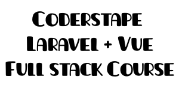

<h1 align="center">
    
</h1>

  <a href="#-technologies">Technologies</a>&nbsp;&nbsp;&nbsp;|&nbsp;&nbsp;&nbsp;
  <a href="#-project">Project</a>&nbsp;&nbsp;&nbsp;|&nbsp;&nbsp;&nbsp;
  <a href="#memo-licença">Licença</a>

 

  

## 🔖 Project

I built this project when i was studying the Laravel + VueJs Course by https://coderstape.com/. We Use all Fullstack pratices: TDD, Docker, Laravel, PHP Unit, vueJS and others.

## 🚀 Technologies

- Vue
- Vuex
- Tailwind-css
- Laravel
- Docker
- Docker-compose
- TDD
- Php-unit

## :memo: Licença

Project under MIT license. Visit [LICENSE](LICENSE.md) to more.

<small>Fonte: la Unica 35 px - Photopea</>
